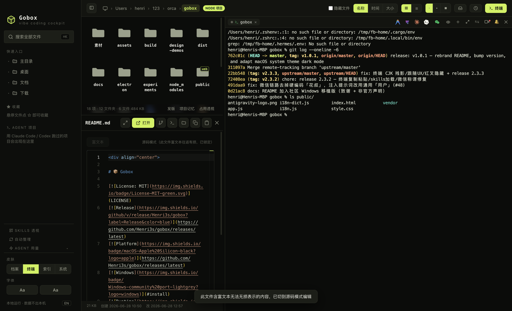
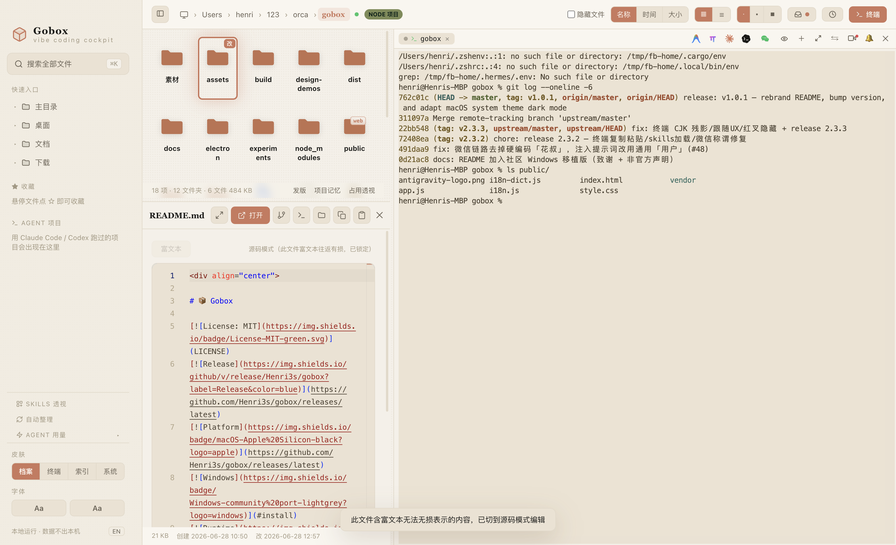
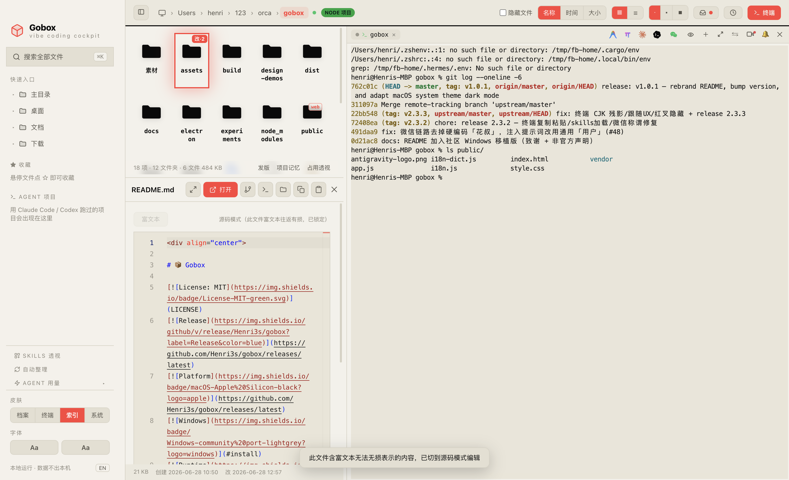

<div align="center">

# 📦 Gobox

[](LICENSE)
[](https://github.com/Henri3s/gobox/releases/latest)
[](https://github.com/Henri3s/gobox/releases/latest)
[](#install)
[](#architecture)
[](https://github.com/alchaincyf/fanbox)

<br>


> 🍃 **Gobox 是 [FanBox](https://github.com/alchaincyf/fanbox) 的 Fork 版本**，由原作者 [花叔 Huashu](https://github.com/alchaincyf) 开源。本 Fork 在保留 FanBox 优秀架构与核心功能的基础上，新增了**自定义字体、AI 自动整理规则引擎、macOS Liquid Glass 系统皮肤、Agent 工具链直通**等增强功能，并调整了品牌。非常感谢原作者的开源贡献。
> 
> 🍃 **Gobox is a fork of [FanBox](https://github.com/alchaincyf/fanbox)**, open-sourced by [Huashu](https://github.com/alchaincyf). Built upon the robust foundation of FanBox, this Fork adds **custom fonts, an AI-powered Auto-Tidy rule engine, a macOS system Liquid Glass theme, and enhanced Agent toolchain integrations**, along with a visual rebrand. All credit for the original design belongs to the upstream author.

<br>

[⬇ 下载 dmg / Download dmg](https://github.com/Henri3s/gobox/releases/latest) · [Screenshots / 截图](#four-skins) · [Fork Highlights / 独有特性](#fork-highlights) · [Features / 功能](#what-it-does) · [Install / 安装](#install) · [Credits / 致谢](#credits)

</div>

---

<p align="center">
  
</p>

<p align="center"><sub>▲ 真机截图：浏览 Gobox 仓库本身，README 原地预览，内嵌终端正在运行。截图由 Playwright 从实时 App 中直接拍摄，未修图。<br>Real capture: browsing the Gobox repo itself, README previewed in place, git running in the embedded terminal. All screenshots in this README are taken from the live app via Playwright, unedited.</sub></p>

---

<a id="four-skins"></a>
## Four skins · 四套皮肤

四套皮肤不仅是换个主题色，配色、字体、图标、代码高亮、终端 ANSI 主题整体随之变化，带来截然不同的工作氛围：

The four skins are not theme-color swaps — palette, typography, icons, code highlighting and terminal ANSI themes all change together:

| | |
|---|---|
|  | **终端 · Volt** · 荧光绿 × 炭黑 × 等宽字，工业仪器面板感（默认）<br>**Volt** · neon green × charcoal × monospace, industrial instrument panel (default) |
|  | **档案 · Archive** · 奶油纸 × 赤陶橙 × 衬线，温暖纸感档案馆<br>**Archive** · cream paper × terracotta × serif, a warm paper archive |
|  | **索引 · Index** · 黑白 × 信号红/绿 × 巨号字，编辑式索引日报<br>**Index** · black & white × signal red/green × oversized type, editorial index daily |
|  | **系统 · macOS Liquid Glass** · 跟随系统毛玻璃、实时同步系统强调色与深浅外观，原生 macOS 质感<br>**macOS** · follows system Liquid Glass, syncs accent color and light/dark in real time, native macOS feel |

---

<a id="fork-highlights"></a>
## Fork Highlights · Gobox 独有特性

在继承 FanBox 的基础上，Gobox 新增并增强了以下功能：

Gobox introduces several major features and enhancements over the original project:

* 💅 **系统级 Liquid Glass 皮肤 / macOS System Theme**: 
  - 完美结合 macOS 原生的强调色与深浅主题变化，在切换系统主题时实时同步。采用多层级毛玻璃分层设计，带来极致的原生 App 视觉享受。
  - Synchronizes with macOS system accent color and dark/light mode in real time. Features a glassmorphic multi-layered layout for a native, premium macOS experience.
* 🔠 **自定义双字体选择器 / Custom Font Selector**: 
  - 界面显示字体与终端/编辑器代码字体分开独立配置。自动列出系统已安装的全部 CJK 字体，提供所见即所得的预览，可搜索并一键恢复默认。切换即时刷新，无需销毁或重建当前终端会话。
  - Separately configure UI font and terminal/editor code font. Automatically scans and lists system-installed CJK fonts with live typeface previews. Fully searchable and applies instantly without session loss.
* 🧹 **规则化自动整理引擎 / Rule-based Auto-Tidy**: 
  - 解决「下午起十个项目，桌面全堆满」的痛点。支持在后台以可调度的定时器或右键菜单触发扫描，匹配自定义规则集（如文件类型、时间范围、大小上限等）移动到指定目标，执行前自动生成原子级回滚日志，支持一键撤销与重置。
  - Solves file clutter. Scans designated directories (e.g. Desktop, Downloads) via schedulers or context menus, matching files against rules (type, size, age) to move them. Generates atomic rollback logs for one-click rollbacks.
* 🚀 **Agent 工具链直通车 / Enhanced Agent Integrations**:
  - 顶部终端工具栏集成 `Oh My Pi` 快捷入口与 `Antigravity CLI` 快速启动按钮，优化与本地 Agent 链条的交互流。
  - Integrates quick-launch shortcuts for `Oh My Pi` and `Antigravity CLI` in the terminal toolbar to simplify local agent operations.

---

<a id="what-it-does"></a>
## What it does · 核心功能

### Files · find & preview / 文件 · 找回与预览

- **⌘K 全局模糊搜索 / Global fuzzy search** — 记得名字片段就行；`⌘↵` 用编辑器整包打开项目；`内容:关键词` 切全文搜索。  
  A fragment of the name is enough; `⌘↵` opens the project in your editor; `content:keyword` switches to full-text search.
- **强色实体图标 / Bold solid icons** — 每种文件「长得像它自己」：PDF 红、JS 黄、Markdown 蓝；照片视频按真实比例呈现。  
  Every file type "looks like itself": red PDFs, yellow JS, blue Markdown; photos and videos render at true aspect ratio.
- **原地预览 / Preview in place** — Markdown 渲染、HTML 实时成品、代码语法高亮、图片/视频/PDF 内嵌（HEIC 直接显示）、压缩包内容清单、透明图棋盘格垫底。  
  Rendered Markdown, live HTML, syntax-highlighted code, inline images/video/PDF (HEIC included), archive content listing, checkerboard backing for transparent images.
- **缩略图加速 / Thumbnail speed** — 大文件夹滚动和点击都在 0.1 秒内。  
  Scrolling and clicking through large folders stays under 0.1s.
- **项目徽章 / Project badges** — 文件夹卡片标 node / web / py / rs / go 徽章，起过的十个项目一眼认出类型。  
  Folder cards show node / web / py / rs / go badges, so ten projects are recognizable at a glance.

### Watch what the agent changed · 看 agent 改了什么

- **活的仪表盘 / A live dashboard** — agent 每写一个文件，那张卡片当场荡开涟漪、按改动频率发光呼吸，agent 写到哪光走到哪。  
  Every file the agent writes makes its card ripple and glow by change frequency; the light follows wherever the agent goes.
- **跟随模式 / Follow mode** — 一键让文件视图 + 预览跟踪 agent 正在编辑的文件：代码随新写行高亮闪烁，HTML 边写边实时渲染（双缓冲、零白闪），Markdown 实时渲染。任何手动浏览立即把控制权交还给你。  
  One click and the file view + preview track whatever file the agent edits: code scrolls with freshly written lines flashing, HTML renders as a live web page while it's being written (double-buffered, zero white flash), Markdown renders live. Any manual browsing hands control back to you instantly.
- **会话回放 / Session replay** — 像刷视频一样拖时间轴，重现这段时间 agent 一步步改了哪些文件。  
  Drag the timeline like scrubbing a video to replay which files the agent touched, step by step.
- **变更收件箱 / Change inbox** — 跨多个项目汇总本会话所有被改动的文件，多项目并行跑 agent 不再各看各的。  
  All files modified this session, aggregated across projects, for parallel agent runs.
- **Git 改动 diff / Git diff** — Monaco 只读 DiffEditor 并排展示 HEAD vs 当前工作区，看清 agent 到底改了哪几行。  
  Monaco read-only DiffEditor, HEAD vs working tree side by side.

### Agent cockpit · Agent 驾驶舱

- **项目记忆 / Project memory** — 点开任何项目文件夹，看 AI 在这里干过什么：历史会话（你的第一句话当标题）、每次会话改过的文件、触发过的 skill；「▶ 续上」一键在内嵌终端 `claude --resume` / `codex resume` 接上当时的上下文。  
  Open any project folder and see what AI did there: past sessions (your first message as the title), the files each session changed, the skills it triggered — and a "resume" button that reconnects the context via `claude --resume` / `codex resume` in the embedded terminal.
- **截图直通车 / Screenshot express** — 系统截屏落盘即浮出直通卡：喂给终端里的 agent、收进项目 `素材/`、或先标注再发。  
  Take a system screenshot and a card pops up in the corner: feed it to the terminal agent, file it into the project's `素材/` (assets) folder, or annotate before sending.
- **发版向导 / Release wizard** — node项目一键串起版本号、CHANGELOG、打包、推送、GitHub Release，整条命令序列在内嵌终端可见地跑。  
  For node projects: version bump, CHANGELOG promotion, build, push and GitHub Release composed into one command sequence that runs visibly in the embedded terminal.
- **Skills 透视 / Skills X-ray** — 本机全部 agent skills 一个视图：触发统计、健康检查、context 预算、不删文件的启停开关。  
  Every agent skill on your machine in one view: trigger statistics, health checks (description truncation, missing frontmatter), context budget, enable/disable without deleting.
- **Agent 用量 / Agent usage** — Claude Code 官方 5h 窗口/周配额（和 `/usage` 同源）+ 本地 token 统计；Codex 限额快照 + 窗口重置识别。  
  Claude Code official 5h window / weekly quota (same source as `/usage`) plus local token statistics; Codex window snapshots with reset detection.
- **磁盘占用透视 / Disk usage lens** — `du` 口径的真实占用条形榜，可下钻，专治「电脑空间又满了」。  
  `du`-accurate bars per folder, drill-down, for the "my disk is full again" moments.

### Terminal · command the agent / 终端 · 指挥 agent

- **真实内嵌终端 / A real embedded terminal** — node-pty + xterm.js（WebGL 渲染），跑 Claude Code / vim / htop 不花屏，中文宽字符正确，配合 WebGL 缓存重绘解决 CJK 残影乱码问题。  
  node-pty + xterm.js (WebGL). Claude Code / vim / htop render correctly, CJK wide characters included, with WebGL atlas clear to avoid CJK residue.
- **拖文件进终端 / Drag files in** — 从文件列表拖文件/文件夹进终端，自动插入路径喂给 agent 当上下文。  
  Drop a file or folder into the terminal to insert its path as agent context.
- **路径可点击 / Clickable paths** — 终端里出现的文件路径直接点击在 Gobox 打开；带空格的 macOS 截屏名、中文文件名、折行的长路径都能识别（空格边界由文件系统 stat 验证，不靠猜）。  
  File paths appearing in terminal output open in Gobox on click; macOS screenshot names with spaces, Chinese filenames and wrapped long paths are all recognized (space boundaries verified by stat, not guessed).
- **选中即甩给终端 / Send selection** — 预览里选一段文字，一键以「文件出处 + 围栏」格式发进终端（bracketed paste 包裹，不会被逐行误执行）。  
  Select text in a preview and fling it into the terminal with file provenance + fencing (bracketed paste, never executed line by line).
- **态势感知 / Situational awareness** — 标签圆点显示 agent 运行/空闲/退出；agent 把球踢回给你时终端边缘呼吸提示「轮到你」，长任务完成发系统通知。  
  Tab dots show running/idle/exited; when the agent hands the ball back, the terminal edge breathes; long tasks fire a system notification.

### Editing · WYSIWYG / 编辑 · 所见即所得

- **Markdown** — Milkdown Crepe 提供 Notion 式所见即所得，打开就是编辑态，停笔 0.8 秒自动保存。  
  Milkdown Crepe, Notion-style WYSIWYG; opens in edit mode, auto-saves 0.8s after you stop typing.
- **代码/JSON / Code/JSON** — Monaco 编辑器（VS Code 同款内核），随皮肤切换主题。  
  Monaco (the VS Code core), themed per skin.
- **图片标注 / Image annotation** — 画笔/箭头/文字/打码、格式转换、压缩、调分辨率，覆盖原图前有确认。  
  Pen/arrow/text/redaction, format conversion, compression, resizing; overwriting the original asks first.
- **未保存守卫 / Unsaved guard** — 三种编辑器统一拦截未保存退出，Esc 旁路也堵死。  
  All three editors intercept unsaved exits, including the Esc bypass.

---

<a id="install"></a>
## Install · 安装

### 桌面版（推荐）/ Desktop (recommended)

从 [**Releases**](https://github.com/Henri3s/gobox/releases/latest) 下载最新 `.dmg`，拖进「应用程序」即可。Apple Silicon (arm64) 原生。

Download the latest `.dmg` from [**Releases**](https://github.com/Henri3s/gobox/releases/latest) and drag it into Applications. Native Apple Silicon (arm64).

> 已用 Apple Development 证书签名 + hardened runtime。首次打开若提示「未验证的开发者」：**右键 → 打开 → 确认**即可。  
> Signed with an Apple Development certificate + hardened runtime. If macOS warns about an unverified developer on first launch: **right-click → Open → confirm**.
>
> 应用内置**更新提醒**：检测到 GitHub 上有新 Release 时，右下角会弹一条提示引导下载，不强更、可对单个版本「不再提醒」。  
> Built-in **update notifications**: when a new release lands on GitHub, a capsule appears at the bottom right. Never forced; individual versions can be muted.

### Windows（社区移植，非官方）/ Windows (community ports, unofficial)

> ⚠️ 以下版本为社区基于原版 FanBox 拓展的 Windows 版本。Gobox 暂无官方维护的 Windows 构建。请自行评估后使用。
> ⚠️ The builds below are community Windows ports based on FanBox. Gobox has no officially supported Windows builds yet. Use at your own discretion.

| 移植 / Port | 链接 / Link |
|---|---|
| daodao166888/fanbox-windows | [Releases](https://github.com/daodao166888/fanbox-windows/releases) |
| cookiesheep/fanbox（v2.3.0 Windows） | [Release](https://github.com/cookiesheep/fanbox/releases/tag/v2.3.0-windows) |

### 网页版（不打包，直接跑）/ Web (no packaging)

```bash
node server.js
```

浏览器打开 `http://localhost:4567`。零依赖、零 build，clone 下来就能跑。网页版仅提供文件浏览/搜索/预览等轻量功能（内嵌终端和编辑器需要桌面壳的支持）。

Open `http://localhost:4567`. Zero dependencies, zero build — clone and run. The web version covers browsing/search/preview (the embedded terminal and editors need Electron).

### 开发模式 / Development

```bash
npm install
npm run app          # electron . 启动开发调试版 / launch dev version
npm run dist         # 打包签名 .dmg / build & sign the .dmg
```

> 打包遇到 Electron 下载超时：`ELECTRON_MIRROR="https://registry.npmmirror.com/-/binary/electron/" npm run dist`

---

<a id="shortcuts"></a>
## Shortcuts · 快捷键

| 操作 / Action | 键 / Key | 操作 / Action | 键 / Key |
|---|---|---|---|
| 全局搜索 / Global search | `⌘K` | 用编辑器打开 / Open in editor | `⌘↵` |
| 折叠侧栏 / Toggle sidebar | `⌘B` | 后退 / Back | `⌘[` |
| 当前目录筛选 / Filter current folder | `/` | 打开/预览 / Open/preview | `↵` |
| 结果上下选择 / Navigate results | `↑` `↓` | 关闭 / Close | `Esc` |

---

<a id="privacy"></a>
## Privacy & security · 隐私与安全

- 后端只在本机回环地址监听 + 校验 Host 头，**数据不出本机**。  
  The backend listens on loopback only and validates the Host header. **Data never leaves your machine.**
- 全部前端资源本地内置，**离线完全可用**。仅有的出网请求：Claude 用量接口（可选）和 GitHub 更新检查。  
  All frontend assets are vendored locally — **fully usable offline**. The only outbound calls: the Claude usage API (optional) and the GitHub release check.
- HTML 预览在隔离 origin 的沙箱 iframe 里渲染，预览不可信网页也碰不到终端能力。  
  HTML previews render in a sandboxed iframe with an opaque origin; an untrusted page can never reach terminal capabilities.
- 删除走系统废纸篓（可恢复）；缩略图缓存按最旧优先自动裁剪，上限 400MB。  
  Deletions go to the system Trash (recoverable); the thumbnail cache prunes oldest-first with a 400MB cap.

---

<a id="architecture"></a>
## Technical Stack & Architecture · 技术架构

| 层 / Layer | 使用技术 / Stack |
|---|---|
| 后端 / Backend | 零依赖 Node.js `server.js`（文件 API + 静态服务 + 缩略图） + 自动整理规则引擎<br>Zero-dependency Node.js `server.js` (file APIs + static serving + thumbnails) + Auto-Tidy Engine |
| 桌面壳 / Desktop shell | Electron 33 + node-pty（asarUnpack 原生模块）<br>Electron 33 + node-pty (asarUnpack native module) |
| 终端 / Terminal | xterm.js + WebGL 渲染器 + unicode11 |
| 编辑器 / Editors | Monaco（代码）+ Milkdown Crepe（Markdown）<br>Monaco (code) + Milkdown Crepe (Markdown) |
| 打包 / Packaging | electron-builder → 签名 arm64 .dmg<br>electron-builder → signed arm64 .dmg |

<details>
<summary>项目目录结构 / Project layout</summary>

```
gobox/
├── server.js               # 零依赖 Node 后端与自动整理引擎核心逻辑
│                           # Zero-dependency Node backend & Auto-Tidy engine logic
├── electron/
│   ├── main.js             # 主进程（窗口/pty/剪贴板/更新/文件监听）
│   │                       # Main process (window/pty/clipboard/fs.watch/menu)
│   └── preload.js          # 暴露 pty、fs 等桥接能力给渲染进程
│                           # Exposes fanboxPty / fanboxFs / fanboxClipboard
├── public/
│   ├── index.html
│   ├── style.css
│   ├── app.js              # 前端单页应用（含系统主题同步、双字体配置、整理UI）
│   │                       # Frontend SPA (incl. theme sync, fonts config, tidy UI)
│   └── vendor/             # 本地化第三方库资源（xterm / monaco / milkdown）
│                           # xterm / monaco / milkdown local assets
├── src-vendor/             # esbuild 入口，产出本地 vendor
├── build/                  # 图标和 entitlements 配置
├── docs/                   # 产品规格与各阶段设计文档
└── experiments/            # 辅助开发与截图测试脚本
```

</details>

---

<a id="credits"></a>
## Credits & Attribution · 致谢与声明

Gobox 构建于优秀的开源社区之上，在此向以下开源项目致以崇高谢意：

Gobox's core capabilities come from these excellent open-source projects:

- **[FanBox](https://github.com/alchaincyf/fanbox)**: Gobox 分支的母版项目。原作者 **花叔 Huashu**（[@alchaincyf](https://github.com/alchaincyf)）设计了其优雅紧凑的单窗口多模态理念。代表作：小猫补光灯。
- **[Electron](https://www.electronjs.org/)**: 桌面壳底座。
- **[node-pty](https://github.com/microsoft/node-pty)**: 终端连接核心。
- **[xterm.js](https://xtermjs.org/)**: 高性能终端渲染。
- **[Monaco Editor](https://microsoft.github.io/monaco-editor/)**: 编辑器核心（VS Code 同款）。
- **[Milkdown](https://milkdown.dev/)** & **[marked](https://marked.js.org/)**: Markdown 编辑与预览渲染。
- **[highlight.js](https://highlightjs.org/)**: 语法高亮。
- **[electron-builder](https://www.electron.build/)**: 构建打包框架。

---

<div align="center">

**Finder** 帮你管理文件。**IDE** 帮你写代码。**Gobox** 帮你看清 AI 在你机器上干了什么。<br>
**Finder** manages your files. **IDEs** write your code. **Gobox** shows you what AI did on your machine.

<br>

MIT License · Fork of [FanBox](https://github.com/alchaincyf/fanbox) by [花叔 Huashu](https://github.com/alchaincyf) · Fork maintained by [Henri Zhou](https://github.com/Henri3s)

</div>
